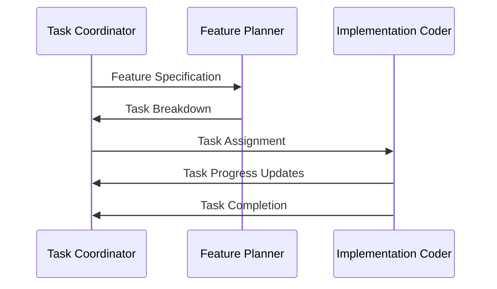
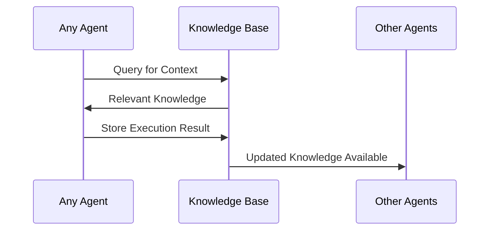
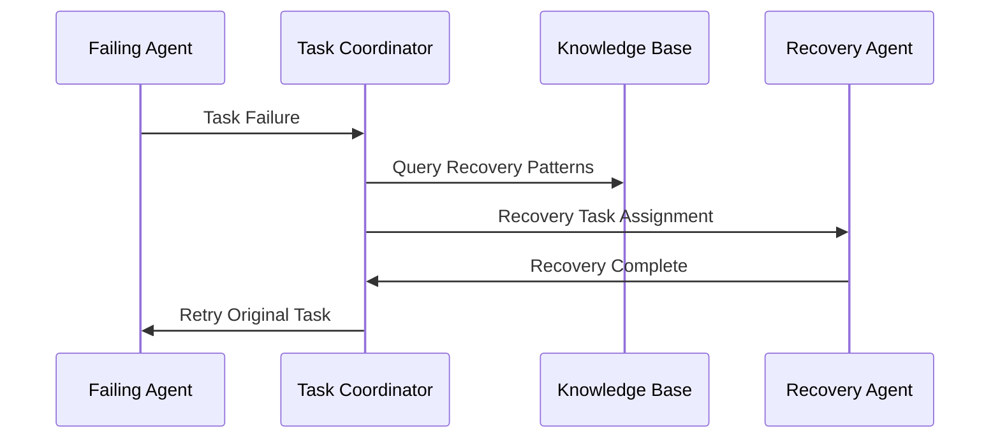
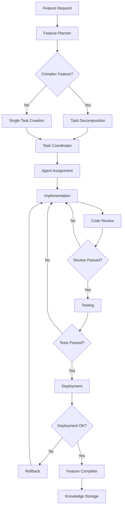
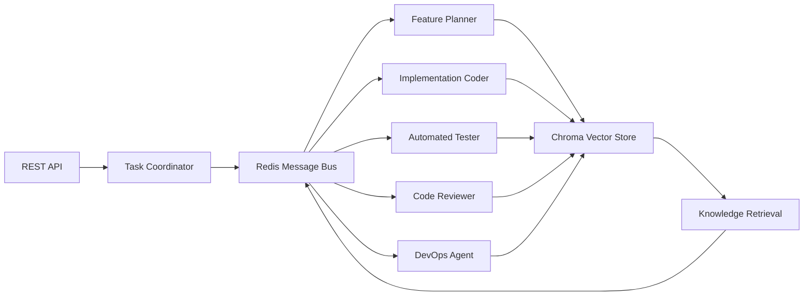

# Agent Factory - System Architecture

Complete architectural documentation for the Agent Factory autonomous development system.

## Table of Contents

- [System Overview](#system-overview)
- [High-Level Architecture](#high-level-architecture)
- [Core Components](#core-components)
- [Agent Roles and Capabilities](#agent-roles-and-capabilities)
- [Communication Patterns](#communication-patterns)
- [Knowledge Management](#knowledge-management)
- [Workflow Orchestration](#workflow-orchestration)
- [Data Flow](#data-flow)
- [Deployment Architecture](#deployment-architecture)
- [Scalability Considerations](#scalability-considerations)
- [Security Architecture](#security-architecture)

## System Overview

Agent Factory is a multi-agent autonomous development system that transforms high-level feature specifications into complete, tested, and deployed applications. The system follows a microservices architecture with specialized AI agents coordinating through message passing and shared knowledge storage.

### Core Principles

- **Agent Specialization**: Each agent has specific domain expertise
- **Async Communication**: All inter-agent communication is asynchronous
- **Persistent Knowledge**: Shared vector database for context and learning
- **Workflow Orchestration**: Structured execution with validation gates
- **Self-Learning**: Continuous improvement from execution outcomes

### Architecture Style

**Event-Driven Microservices** with:
- Service mesh communication via Redis pub/sub
- Shared state via vector database (Chroma)
- Container-based deployment
- Horizontal scaling capabilities

## High-Level Architecture

```
┌─────────────────────────────────────────────────────────────────┐
│                        Agent Factory System                     │
├─────────────────────────────────────────────────────────────────┤
│                                                                 │
│  ┌─────────────┐    ┌─────────────┐    ┌─────────────┐         │
│  │  External   │    │   Web UI    │    │   REST API  │         │
│  │    APIs     │    │ (Streamlit) │    │  (FastAPI)  │         │
│  └─────────────┘    └─────────────┘    └─────────────┘         │
│           │                 │                 │                 │
│           └─────────────────┼─────────────────┘                 │
│                             │                                   │
│  ┌─────────────────────────────────────────────────────────────┐ │
│  │                API Gateway & Load Balancer                  │ │
│  └─────────────────────────────────────────────────────────────┘ │
│                             │                                   │
│  ┌─────────────────────────────────────────────────────────────┐ │
│  │                 Agent Orchestration Layer                   │ │
│  │                                                             │ │
│  │  ┌─────────────┐  ┌─────────────┐  ┌─────────────┐         │ │
│  │  │Task         │  │Feature      │  │Code         │         │ │
│  │  │Coordinator  │  │Planner      │  │Reviewer     │         │ │
│  │  └─────────────┘  └─────────────┘  └─────────────┘         │ │
│  │                                                             │ │
│  │  ┌─────────────┐  ┌─────────────┐  ┌─────────────┐         │ │
│  │  │Implementation│  │Automated    │  │DevOps       │         │ │
│  │  │Coder        │  │Tester       │  │Agent        │         │ │
│  │  └─────────────┘  └─────────────┘  └─────────────┘         │ │
│  └─────────────────────────────────────────────────────────────┘ │
│                             │                                   │
│  ┌─────────────────────────────────────────────────────────────┐ │
│  │                Communication Layer                          │ │
│  │                                                             │ │
│  │  ┌─────────────────┐           ┌─────────────────┐           │ │
│  │  │ Redis Message   │           │ WebSocket       │           │ │
│  │  │ Bus (Pub/Sub)   │           │ Streaming       │           │ │
│  │  └─────────────────┘           └─────────────────┘           │ │
│  └─────────────────────────────────────────────────────────────┘ │
│                             │                                   │
│  ┌─────────────────────────────────────────────────────────────┐ │
│  │                Storage & Knowledge Layer                     │ │
│  │                                                             │ │
│  │  ┌─────────────────┐           ┌─────────────────┐           │ │
│  │  │ Chroma Vector   │           │ PostgreSQL      │           │ │
│  │  │ Database        │           │ (Metadata)      │           │ │
│  │  │ (Knowledge)     │           │                 │           │ │
│  │  └─────────────────┘           └─────────────────┘           │ │
│  └─────────────────────────────────────────────────────────────┘ │
│                             │                                   │
│  ┌─────────────────────────────────────────────────────────────┐ │
│  │                External Integrations                        │ │
│  │                                                             │ │
│  │  ┌───────────┐ ┌───────────┐ ┌───────────┐ ┌───────────┐   │ │
│  │  │    Git    │ │   Docker  │ │    LLM    │ │   MCP     │   │ │
│  │  │ (GitHub)  │ │ Registry  │ │Providers  │ │ Servers   │   │ │
│  │  └───────────┘ └───────────┘ └───────────┘ └───────────┘   │ │
│  └─────────────────────────────────────────────────────────────┘ │
└─────────────────────────────────────────────────────────────────┘
```

## Core Components

### API Layer

#### REST API (FastAPI)
- **Purpose**: External system integration and user interfaces
- **Responsibilities**:
  - Feature specification submission
  - Progress monitoring and status queries
  - Agent configuration and management
  - Authentication and authorization
- **Key Features**:
  - OpenAPI documentation
  - Rate limiting and throttling
  - Request validation with Pydantic
  - Async request handling

#### WebSocket Streaming
- **Purpose**: Real-time progress updates and system events
- **Responsibilities**:
  - Feature progress streaming
  - Agent status broadcasts
  - System health monitoring
  - Live log streaming
- **Protocols**:
  - Per-feature progress streams
  - System-wide event streams
  - Agent-specific status streams

### Agent Orchestration Layer

#### Task Coordinator
```python
class TaskCoordinator(BaseAgent):
    """Central orchestration agent managing the entire development lifecycle."""
    
    capabilities = [
        "task_orchestration",
        "dependency_management", 
        "resource_allocation",
        "workflow_coordination",
        "progress_tracking"
    ]
```

**Responsibilities**:
- **Workflow Management**: Orchestrates the entire feature development lifecycle
- **Task Distribution**: Assigns tasks to appropriate specialized agents
- **Dependency Resolution**: Manages task dependencies and execution order
- **Progress Monitoring**: Tracks overall progress and reports status
- **Resource Management**: Manages agent workload and availability

#### Feature Planner
```python
class FeaturePlanner(BaseAgent):
    """Planning agent that decomposes features into executable tasks."""
    
    capabilities = [
        "requirements_analysis",
        "task_decomposition",
        "dependency_identification",
        "prp_generation",
        "architecture_planning"
    ]
```

**Planning Process**:
1. **Requirements Analysis**: Parse and understand feature specifications
2. **Context Retrieval**: Query knowledge base for relevant patterns
3. **Task Breakdown**: Decompose features into granular, executable tasks
4. **Dependency Mapping**: Identify task relationships and execution order
5. **PRP Creation**: Generate detailed PRPs for each task
6. **Timeline Estimation**: Provide completion estimates

### Communication Layer

#### Redis Message Bus
```python
class RedisMessageBus:
    """Async message bus for inter-agent communication."""
    
    def __init__(self):
        self.redis = aioredis.Redis()
        self.subscriptions = {}
        
    async def publish(self, channel: str, message: AgentMessage):
        """Publish message to specified channel."""
        
    async def subscribe(self, channel: str, handler: Callable):
        """Subscribe to channel with message handler."""
        
    async def broadcast(self, message: AgentMessage):
        """Broadcast message to all agents."""
```

**Communication Patterns**:
- **Direct Messaging**: Agent-to-agent task assignment and responses
- **Broadcast Events**: System-wide status updates and coordination
- **Topic-Based**: Feature-specific coordination and updates
- **Request-Response**: Synchronous communication patterns

#### Message Protocols
```python
@dataclass
class AgentMessage:
    id: str
    sender_id: str
    recipient_id: str
    message_type: MessageType
    payload: Dict[str, Any]
    timestamp: datetime
    correlation_id: Optional[str] = None
```

**Message Types**:
- `TASK_ASSIGNMENT`: New task assignment to agent
- `TASK_RESULT`: Task completion notification
- `COORDINATION`: System coordination messages
- `PROGRESS_UPDATE`: Progress status updates
- `ERROR`: Error notifications and handling
- `HEARTBEAT`: Agent health and availability

### Storage Layer

#### Vector Database (Chroma)
```python
class ChromaVectorStore:
    """Vector database for knowledge storage and retrieval."""
    
    def __init__(self):
        self.client = chromadb.Client()
        self.collection = self.client.create_collection(
            name="agent_knowledge",
            embedding_function=SentenceTransformerEmbeddings()
        )
        
    async def store_entry(self, entry: KnowledgeEntry):
        """Store knowledge entry with vector embedding."""
        
    async def query(self, query: str, max_results: int = 5):
        """Semantic search for relevant knowledge."""
```

**Knowledge Categories**:
- **Code Patterns**: Successful implementation patterns
- **Architecture Decisions**: Historical design choices
- **Failure Cases**: Previous failures and recovery strategies
- **Domain Knowledge**: Framework documentation and best practices
- **Context**: Project-specific context and preferences

#### Metadata Storage (PostgreSQL)
- **Projects**: Project definitions and metadata
- **Features**: Feature specifications and status
- **Tasks**: Task definitions and progress tracking
- **Agents**: Agent configurations and performance metrics
- **Audit Logs**: Complete system activity history

## Agent Roles and Capabilities

### Implementation Coder
```python
class ImplementationCoder(BaseAgent):
    """Specialized agent for code implementation."""
    
    capabilities = [
        "python_development",
        "javascript_development",
        "api_implementation",
        "database_integration",
        "test_writing"
    ]
```

**Core Functions**:
- **Code Generation**: Creates production-ready code from specifications
- **Integration**: Integrates new code with existing codebase
- **Refactoring**: Improves code structure and maintainability
- **Documentation**: Generates inline documentation and README updates

**Implementation Process**:
1. **Context Analysis**: Reviews existing codebase and patterns
2. **Design Planning**: Creates implementation approach
3. **Code Generation**: Implements features following best practices
4. **Integration Testing**: Ensures compatibility with existing systems
5. **Documentation**: Updates relevant documentation

### Automated Tester
```python
class AutomatedTester(BaseAgent):
    """Testing specialist ensuring code quality."""
    
    capabilities = [
        "unit_testing",
        "integration_testing",
        "performance_testing",
        "security_testing",
        "test_automation"
    ]
```

**Testing Workflow**:
1. **Test Planning**: Identifies test scenarios and coverage requirements
2. **Test Generation**: Creates comprehensive test suites
3. **Execution**: Runs tests and collects results
4. **Coverage Analysis**: Ensures adequate test coverage
5. **Performance Validation**: Validates performance requirements
6. **Security Testing**: Identifies potential security vulnerabilities

### Code Reviewer
```python
class CodeReviewer(BaseAgent):
    """Quality assurance specialist."""
    
    capabilities = [
        "code_review",
        "standards_enforcement",
        "security_analysis",
        "performance_analysis",
        "architecture_review"
    ]
```

**Review Process**:
1. **Static Analysis**: Automated code quality checks
2. **Standards Compliance**: Ensures coding standards adherence
3. **Security Review**: Identifies security vulnerabilities
4. **Performance Analysis**: Reviews for performance bottlenecks
5. **Architecture Validation**: Ensures design consistency

### DevOps Agent
```python
class DevOpsAgent(BaseAgent):
    """Deployment and infrastructure specialist."""
    
    capabilities = [
        "containerization",
        "deployment_automation",
        "infrastructure_management",
        "monitoring_setup",
        "rollback_management"
    ]
```

**Deployment Pipeline**:
1. **Build Preparation**: Creates build configurations
2. **Containerization**: Packages applications in containers
3. **Environment Setup**: Configures deployment environments
4. **Deployment Execution**: Performs automated deployments
5. **Health Monitoring**: Monitors application health post-deployment
6. **Rollback Management**: Handles deployment rollbacks if needed

## Communication Patterns

### Task Assignment Pattern


### Knowledge Sharing Pattern


### Error Handling Pattern


## Knowledge Management

### Knowledge Base Architecture

```python
class KnowledgeEntry:
    """Structured knowledge entry."""
    content: str
    embedding: List[float] 
    source_type: SourceType  # CODE, DOCUMENTATION, PRP, PATTERN, FAILURE
    metadata: Dict[str, Any]
    tags: List[str]
    created_at: datetime
```

### Knowledge Categories

#### Implementation Patterns
- **Successful Code Patterns**: Proven implementation approaches
- **Architecture Decisions**: Design choices and rationale
- **Integration Patterns**: Successful system integrations
- **Performance Optimizations**: Effective performance improvements

#### Context Information
- **Project Structure**: Codebase organization and conventions
- **Team Preferences**: Coding standards and tool preferences  
- **Domain Knowledge**: Business logic and requirements
- **Technical Constraints**: System limitations and requirements

#### Learning Outcomes
- **Success Stories**: What works well and why
- **Failure Analysis**: What doesn't work and how to avoid it
- **Performance Metrics**: Actual vs. expected performance
- **User Feedback**: Real-world usage patterns and issues

### Retrieval-Augmented Generation (RAG)

```python
async def get_context_for_task(task: TaskSpecification) -> str:
    """Retrieve relevant context for task execution."""
    
    # Query for similar successful implementations
    patterns = await knowledge_base.query(
        f"successful {task.requirements} implementation",
        source_type=SourceType.PATTERN
    )
    
    # Query for relevant documentation
    docs = await knowledge_base.query(
        task.description,
        source_type=SourceType.DOCUMENTATION
    )
    
    # Query for potential gotchas
    failures = await knowledge_base.query(
        f"{task.requirements} common failures",
        source_type=SourceType.FAILURE
    )
    
    return compile_context(patterns, docs, failures)
```

## Workflow Orchestration

### PRP-Driven Execution

#### PRP Structure for Agents
```python
@dataclass
class AgentPRP:
    goal: str                           # Clear, specific objective
    justification: str                  # Why this task is important
    context: Dict[str, Any]            # All relevant context
    implementation_steps: List[str]     # Step-by-step plan
    validation_criteria: List[str]      # Success criteria
    success_metrics: List[str]          # Measurable outcomes
    failure_recovery: List[str]         # Recovery procedures
```

#### Execution Flow
1. **PRP Creation**: Feature Planner creates comprehensive PRPs
2. **Context Injection**: System adds relevant knowledge base context
3. **Agent Assignment**: Task Coordinator assigns to appropriate agent
4. **Execution**: Agent implements following PRP guidelines
5. **Validation**: System validates against success criteria
6. **Knowledge Storage**: Results stored back to knowledge base

### Workflow State Machine

```python
class FeatureState(Enum):
    PLANNING = "planning"
    IMPLEMENTATION = "implementation"
    REVIEW = "review"
    DEPLOYMENT = "deployment"
    COMPLETED = "completed"
    FAILED = "failed"
```

**State Transitions**:
- `PLANNING` → `IMPLEMENTATION`: Task breakdown complete
- `IMPLEMENTATION` → `REVIEW`: Code implementation complete
- `REVIEW` → `DEPLOYMENT`: Quality gates passed
- `DEPLOYMENT` → `COMPLETED`: Deployment successful
- Any state → `FAILED`: Unrecoverable error

### Validation Gates

#### Level 1: Syntax & Style
```bash
ruff check --fix src/
mypy src/
black src/
```

#### Level 2: Unit Tests
```bash
pytest tests/ -v --cov=src --cov-report=term-missing
```

#### Level 3: Integration Tests
```bash
pytest tests/integration/ -v
docker-compose up -d test-dependencies
```

#### Level 4: Deployment Validation
```bash
docker build -t feature-test .
docker run --rm feature-test python -m pytest tests/deployment/
```

## Data Flow

### Feature Development Flow



### Message Flow Architecture



## Deployment Architecture

### Container Architecture

#### Agent Services
```dockerfile
# Agent Base Image
FROM python:3.12-slim

WORKDIR /app
COPY requirements.txt .
RUN pip install -r requirements.txt

COPY src/ ./src/
COPY config/ ./config/

CMD ["python", "-m", "src.agents.coordinator"]
```

#### Service Composition
```yaml
version: '3.8'
services:
  # Core Infrastructure
  redis:
    image: redis:7-alpine
    ports:
      - "6379:6379"
  
  chroma:
    image: chromadb/chroma:latest
    ports:
      - "8000:8000"
  
  postgres:
    image: postgres:15
    environment:
      POSTGRES_DB: agent_factory
      POSTGRES_USER: agent_factory
      POSTGRES_PASSWORD: ${DB_PASSWORD}
  
  # Agent Services
  coordinator:
    build: .
    command: python -m src.agents.coordinator
    environment:
      - REDIS_URL=redis://redis:6379
      - CHROMA_URL=http://chroma:8000
  
  planner:
    build: .
    command: python -m src.agents.planner
    
  coder:
    build: .
    command: python -m src.agents.coder
    deploy:
      replicas: 3  # Scale for parallel development
  
  # API Services
  api:
    build: .
    command: uvicorn src.api.rest.app:app --host ******* --port 8080
    ports:
      - "8080:8080"
```

### Network Architecture

#### Internal Communication
- **Service Mesh**: All agents communicate via Redis pub/sub
- **Service Discovery**: Docker Compose DNS resolution
- **Load Balancing**: Built-in Docker Compose load balancing

#### External Access
- **API Gateway**: FastAPI application with reverse proxy
- **WebSocket Gateway**: Direct WebSocket connections
- **Health Checks**: Kubernetes-style health monitoring

### Scaling Strategy

#### Horizontal Scaling
- **Stateless Agents**: All agents are stateless and horizontally scalable
- **Load Distribution**: Redis pub/sub naturally distributes work
- **Auto-scaling**: Kubernetes HPA based on CPU/memory usage

#### Vertical Scaling
- **Memory-Intensive Agents**: Coder and Tester agents may need more memory
- **CPU-Intensive Operations**: Code analysis and compilation
- **I/O Optimization**: SSD storage for vector database

## Scalability Considerations

### Performance Bottlenecks

#### Potential Bottlenecks
1. **Vector Database Queries**: Semantic search can be expensive
2. **LLM API Calls**: Rate limits and latency from external providers
3. **Message Bus Throughput**: Redis pub/sub at scale
4. **Code Generation**: CPU-intensive operations

#### Mitigation Strategies
1. **Caching**: Aggressive caching of vector database results
2. **Connection Pooling**: Reuse LLM API connections
3. **Redis Clustering**: Distribute message bus load
4. **Async Processing**: Non-blocking operations throughout

### Resource Allocation

#### Per-Agent Resource Requirements
```yaml
coordinator:
  memory: 1Gi
  cpu: 0.5

planner:
  memory: 2Gi    # Needs more memory for planning
  cpu: 1.0

coder:
  memory: 4Gi    # Heavy memory usage for code generation
  cpu: 2.0

tester:
  memory: 2Gi
  cpu: 1.5

reviewer:
  memory: 1Gi
  cpu: 1.0

devops:
  memory: 1Gi
  cpu: 0.5
```

### Monitoring and Observability

#### Metrics Collection
- **Agent Performance**: Task completion times and success rates
- **System Health**: Resource usage and availability
- **Message Bus**: Queue depths and processing rates
- **Knowledge Base**: Query performance and hit rates

#### Alerting Strategy
- **Agent Failures**: Automatic recovery and notification
- **System Overload**: Scale-out triggers and notifications
- **Quality Issues**: Failed validation gates and review issues

## Security Architecture

### Authentication and Authorization

#### API Security
- **API Keys**: External system authentication
- **JWT Tokens**: Session-based authentication
- **Role-Based Access**: Feature and agent permissions

#### Inter-Service Security
- **Service Mesh**: Encrypted communication between agents
- **Network Policies**: Kubernetes network segmentation
- **Secret Management**: External secret storage (Vault/K8s secrets)

### Data Security

#### Vector Database
- **Encryption at Rest**: Database-level encryption
- **Access Control**: Role-based query permissions
- **Data Sanitization**: PII removal from knowledge entries

#### Message Security
- **Message Encryption**: Redis AUTH and TLS
- **Message Integrity**: Cryptographic signatures
- **Audit Logging**: Complete message history

### Deployment Security

#### Container Security
- **Base Image Scanning**: Vulnerability scanning
- **Runtime Security**: Container runtime monitoring
- **Resource Limits**: Prevention of resource exhaustion

#### Network Security
- **Network Segmentation**: Isolated network namespaces
- **Ingress Control**: API gateway with WAF
- **Egress Control**: Controlled external API access

---

For implementation details and configuration, see:
- [Configuration Guide](CONFIGURATION.md) for setup details
- [API Reference](API_REFERENCE.md) for interface specifications
- [User Guide](USER_GUIDE.md) for usage examples
- [Developer Reference](DEVELOPER_REFERENCE.md) for extension guides
